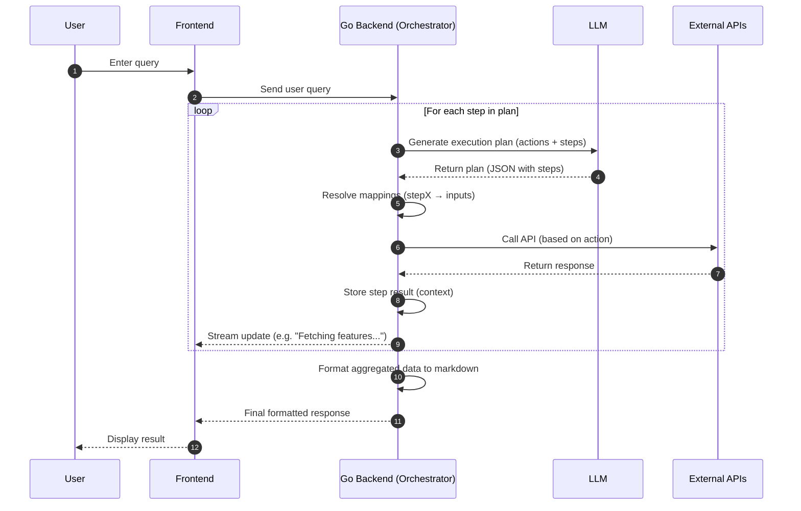

# Ontology AI Agent – LLM-Driven API Orchestration



## 1. Overview

This document describes an AI-powered system designed to provide **summary and analysis of ontology data** using a set of domain-specific APIs.

The system leverages a **Large Language Model (LLM)** to:

* Understand user queries in natural language
* Dynamically decide which ontology APIs to call
* Chain multiple API calls when required
* Aggregate and transform responses
* Return a structured **Markdown summary or analysis**

---

## 2. Objective

The primary goal of this bot is to:

> Enable users to query complex ontology data (features, entities, services, teams, APIs, KPIs) using natural language and receive meaningful insights, summaries, and analysis.

---

## 3. Supported Ontology Domains

The system integrates with the following API domains:

### 3.1 Features

* Retrieve features (`GET /v1/features`)
* Manage features (create/update)
* Fetch feature instances
* Fetch feature metrics (success rate, latency, etc.)

👉 Enables:

* Feature discovery
* Performance analysis
* Activity tracking

---

### 3.2 Entities

* Retrieve entities linked to features
* Manage entities and transitions
* Fetch entity metrics
* Fetch entity-level APIs

👉 Enables:

* Workflow understanding (steps in a feature)
* Transition analysis (success/failure paths)
* Node-level performance insights

---

### 3.3 Services

* Retrieve services
* Update services
* Fetch deployments
* Assign teams

👉 Enables:

* Service ownership mapping
* Deployment tracking
* Criticality analysis

---

### 3.4 Teams

* Retrieve teams
* Map teams to features

👉 Enables:

* Ownership visibility
* Operational accountability

---

### 3.5 APIs

* Retrieve APIs
* Update API metadata
* Fetch API metrics

👉 Enables:

* API performance monitoring
* Internal vs external API insights

---

### 3.6 KPIs

* Retrieve KPIs
* Map KPIs to features/services
* Manage KPI relationships

👉 Enables:

* Business impact analysis
* Metric-driven insights

---

## 4. System Architecture Flow

### Sequence Overview

1. User submits a query
2. Backend sends query to LLM
3. LLM generates execution plan (API steps)
4. Backend executes APIs step-by-step
5. Results are aggregated
6. Final response is formatted into Markdown
7. Response is returned to user

---

## 5. Detailed Execution Flow

### Step 1: User Query

* User enters query like:

  * *"Show feature performance for onboarding"*
  * *"Which team owns failing entities?"*
  * *"Give me API latency insights for auth service"*

Frontend sends query to backend.

---

### Step 2: LLM Planning

Backend sends query + available actions to LLM.

LLM decides:

* Which APIs to call
* In what order
* Whether chaining is required

---

### Step 3: Execution Loop

For each step:

#### 3.1 Plan Generation

* LLM returns structured plan:

```json
{
  "plan": [
    {"step": 1, "action": "get_features"},
    {"step": 2, "action": "get_feature_metrics"}
  ]
}
```

---

#### 3.2 Mapping Resolution

* Backend maps outputs of previous steps:

  * `feature_id → next API`
* Example:

  * `step1.result[0].id → step2.feature_id`

---

#### 3.3 API Execution

* Backend calls the corresponding ontology API
* Applies filters and parameters

---

#### 3.4 Context Storage

* Each response is stored:

```json
{
  "step1": {...},
  "step2": {...}
}
```

---

#### 3.5 Streaming Updates

Frontend receives live updates:

* "Fetching features..."
* "Getting metrics..."
* "Analyzing data..."

---

### Step 4: Aggregation & Analysis

Backend:

* Combines results across domains
* Derives insights such as:

  * Success/failure trends
  * Latency patterns
  * Ownership mapping
  * Bottlenecks in entity transitions

---

### Step 5: Formatting

Backend converts aggregated data into:

* Markdown summaries
* Tables
* Insights & observations

---

### Step 6: Final Response

Frontend displays:

* Clean structured output
* Human-readable analysis

---

## 6. Example Query Flows

---

### Example 1: Feature Performance Analysis

**Query:**
"Show performance of Customer Onboarding feature"

**Execution Plan:**

1. Get feature by name/code
2. Fetch feature metrics

**Output:**

* Success rate
* Failure rate
* Latency percentiles

---

### Example 2: Workflow Analysis

**Query:**
"Show entities and transitions for onboarding"

**Execution Plan:**

1. Get feature
2. Get entities
3. Get transitions

**Output:**

* Flow structure
* Start → intermediate → terminal nodes
* Transition conditions

---

### Example 3: Ownership Mapping

**Query:**
"Which team owns onboarding feature?"

**Execution Plan:**

1. Get feature
2. Get teams for feature

---

### Example 4: API + Service Insight

**Query:**
"Show API latency for auth service"

**Execution Plan:**

1. Get services
2. Get deployments/APIs
3. Get API metrics

---

### Example 5: KPI Impact Analysis

**Query:**
"Which KPIs impact onboarding feature?"

**Execution Plan:**

1. Get KPIs
2. Get KPI relationships

---

## 7. Key Capabilities

### Dynamic Multi-Step Execution

* Automatically chains APIs
* Supports complex queries

---

### Cross-Domain Analysis

Combines:

* Features + Entities + APIs + Services + KPIs

---

### Context-Aware Mapping

* Uses previous results intelligently
* Avoids redundant API calls

---

### Real-Time Feedback

* Streams execution progress

---

### Insight Generation

Beyond raw data, provides:

* Trends
* Anomalies
* Performance insights

---

## 8. Benefits

* Eliminates need for manual API exploration
* Enables non-technical users to query system
* Provides faster debugging and analysis
* Centralizes ontology intelligence

---

## 9. Future Enhancements

* Parallel API execution
* LLM-based anomaly detection
* Alerting (e.g., high failure rate)
* Historical trend analysis
* Visualization (graphs, flows)
* Conversational memory (multi-turn queries)

---

## 10. Summary

This system transforms a set of ontology APIs into an **intelligent analytics layer** by:

* Using LLM for decision making
* Using backend for execution
* Using APIs for data
* Delivering insights in human-readable format

It acts as a **smart ontology analyst**, capable of answering complex questions across features, entities, services, APIs, teams, and KPIs with minimal user effort.
